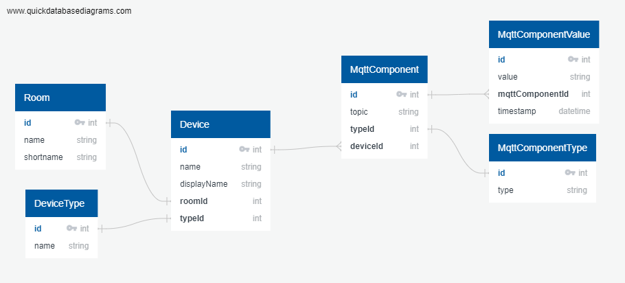

# Qing Long (Blue Dragon)

This is the Database Interface. It's provided with a REST-API.

## Init DB Manually

1. Create Room
   1. name=Kitchen
   2. shortname=kitchen
2. Create MqttComponentType
   1. type=sensor
3. Create MqttComponent
   1. topic=the-verse/kitchen/temperature
   2. typeId=1
4. Create another MqttComponent
   1. topic=the-verse/kitchen/humidity
   2. typeId=1
5. Create DeviceType
   1. name=NodeMCU
6. Create Device
   1. name=motherloore01
   2. displayName=NodeMCU Kitchen
   3. roomId=1
   4. typeId=1
   5. MqttComponentIds=[1,2]
